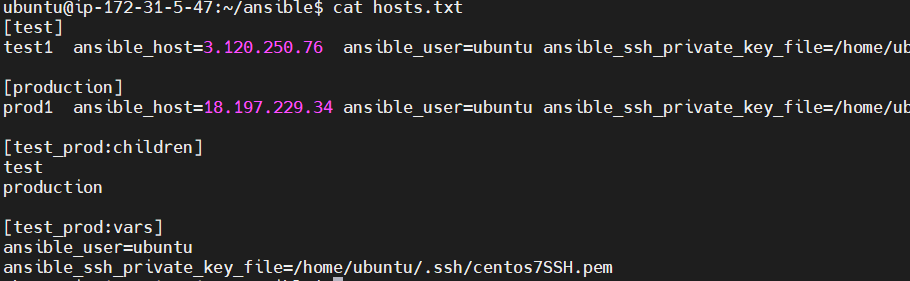
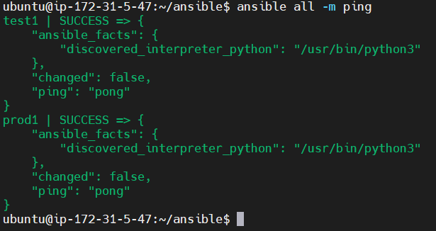
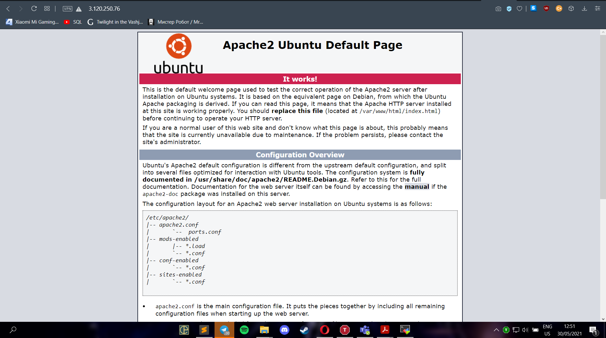
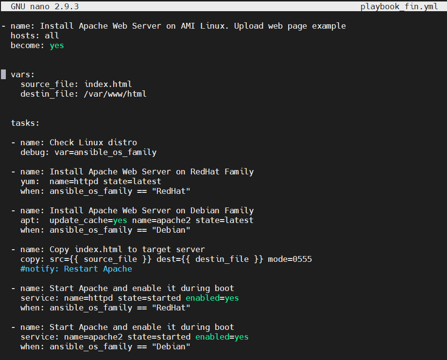
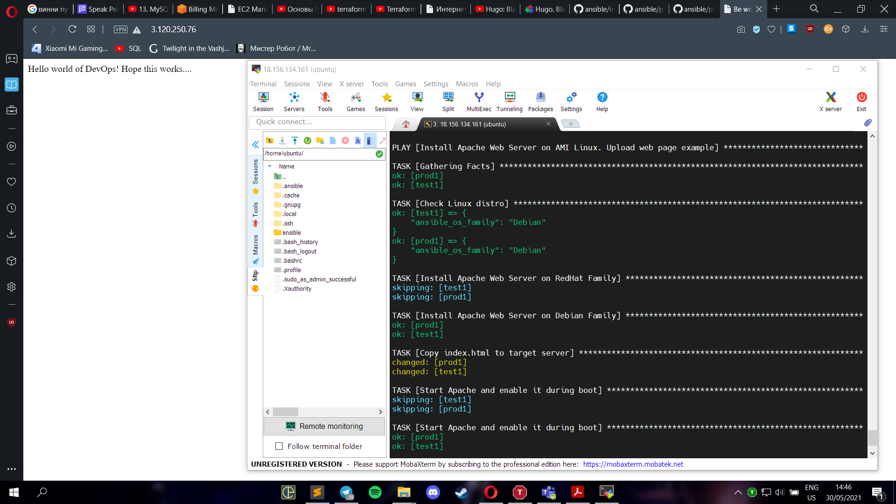

## Task 10.1

I created 3 EC2 instances, 1 named `Ansible` - this will be master, other two named `test` and `prod` - clients. Next, I connected to `Ansible` and installed all necessary modules and created files `hosts.txt`.

Testing connection:

Install apache using command:

`ansible all -m apt -a "name=apache2 state=latest update_cache=yes" -b`

Then, to start and launch on reboot:

`ansible all -m service -a "name=apache2 state=started enabled=yes" -b`

Result: 

I tried playbook, that checks distibutive, installs, copies html file and starts apache service:

Result:

