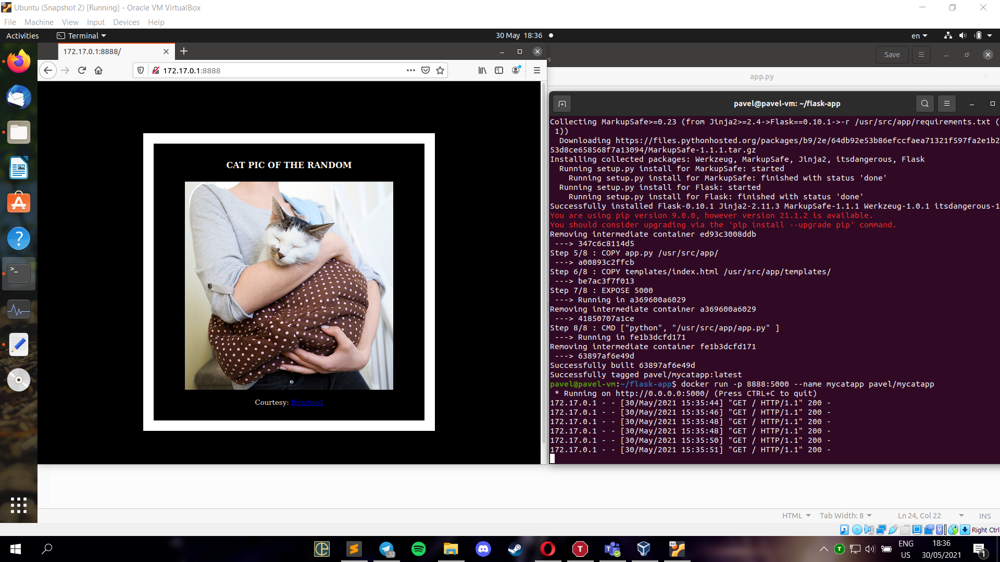
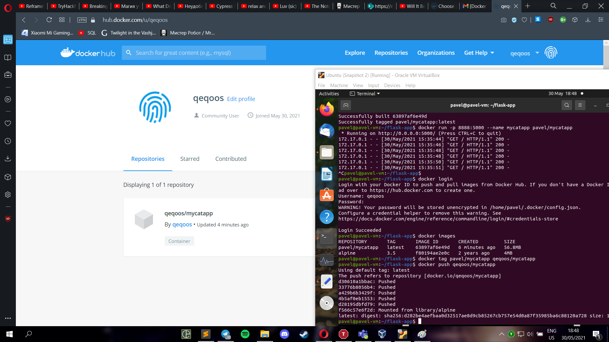

## Task 11.1

First, I installed Docker and all the necessary packages for it.
I run `sudo usermod -aG docker pavel` for executing docker commands in non-root.

Then, I created folder with my cat app, it contains Dockerfile, flask python app, html page and requirements.txt for flask. 

In Dockerfile, I entered basically configuration for docker image: base, packages and modules to install, copying files from host machine, open port. Then, I build an image and run it. 

`docker build -t pavel/mycatapp` and `docker run -p 8888:5000 --name mycatapp pavel/mycatapp`

Here how it looks:

Then, I created docker hub account, logged in through terminal and pushed my container to docker hub.

