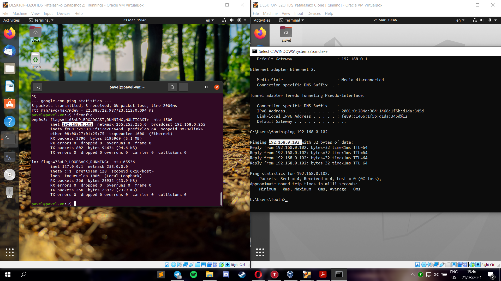
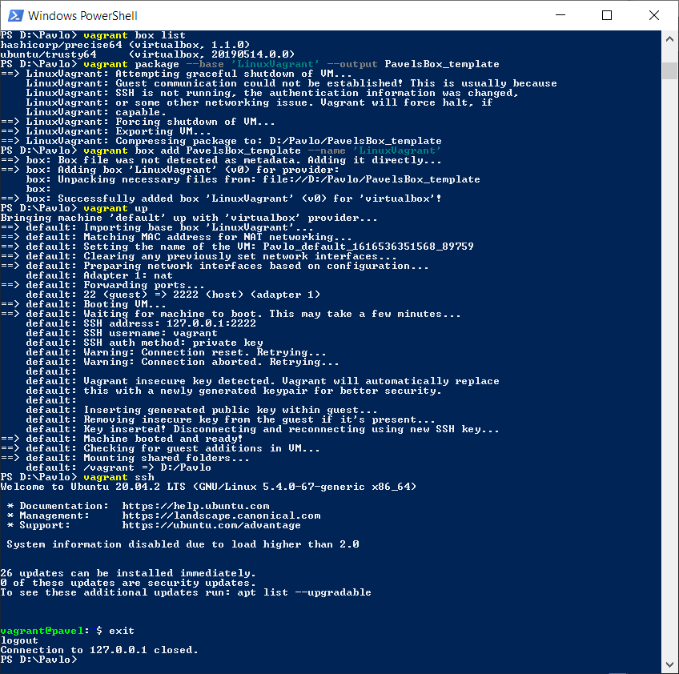

## Part 1: Hypervisors

The most popular hypervisors are **Virtual Box** and **VMware Workstation**.

###### Differences
**VMvare Workstation**, unlike **Virtual Box**, is not free, thus has better client support. 
It will provide better compatibility with VMware servers and data management tools.
**Virtual Box** is open-source, can be installed on Windows, Linux, Mac OS X and Solaris.
**VMvare Workstation** can be installed only on Windows and Linux.
**Virtual Box** consumes less resources. 
**VMvare Workstation** has more tools for virtual networking and integration for test environments.
**VMvare Workstation** is better for enterprice use, **Virtual Box** is better for learning and "home" usage.

## Part 2: Work with Virtual box

The first step was to install Virtual box and create virtual machine. 
I chose ubuntu, gave it 3 GB of RAM, 2 processors and 15 GB of hard drive.

Here it is up and running:

Next step is cloning virtual machine.

Grouped them up to apply different commands or changes simultaneously.

I changed virtual machine a little bit and took snapshot, therefore created snapshot tree. 
This allows me to restore previous states of virtual machine.

I exported first VM and created .ova file, which stands for Open Virtual Appliance.

Then, I imported newmade file into new guest OS.

Next task was to explore configuration options. 
I configured the USB flash drive to connect to the VM. 
You can manually choose device, or set up filter.

Here you can see it in my guest OS.

I created shared folder to exchange files between host and guest. 
Option <code>--automount</code> just automatically mounts shared folder on OS startup.

Here it is in action.

Next part is configuration of network mods. I tested 4 network modes: 

For further tests:
* Host address - <code>192.168.0.107</code>
* First VM - <code>192.168.0.101</code>
* Second VM - <code>192.168.0.102</code>
* First VM in host-only mode - <code>192.168.56.101</code>
* Second VM in host-only mode - <code>192.168.56.102</code>

Host-only mode. Host can ping guests and vice virsa. 
Guests can ping each other, but cannot access internet.

Here we can see, that guests can ping host.

Host can ping second VM. First VM can ping second VM. 
Second VM cannot ping <code>8.8.8.8</code> (google dns).

Internal mode. Guest VMs only can ping each other. 
We can see, that there were attempts to ping host and google.com.

Bridged mode. VMs can ping each other, host and google.com. 
Here first VM pings second VM.

Access to the network.

Host pings second VM.

NAT mode. VMs cannot ping each other. 
VMs can ping host and google.com.

I also worked with Virtual box through command line. 
Here I tried basic commands for starting VM, output list of VMs.

Output of command <code>showvminfo</code>.

## Part 3: Work with Vagrant

I downloaded the last version of Vagrant and installed it. 
I created folder and initialized the environment for Vagrant box with <code>init hashicorp/precise64</code>. 
After that, start Vagrant VM with <code>vagrant up</code>.

Connection to Vagrant VM has been established through SSH using <strong>MobaXtrem</strong>. 
After successful connection I executed command <code>date</code> to ensure, that everything works.

After testing, I stopped and deleted VM.

To create my own vagrant box, firstly I created new VM - Ubuntu Server. 
Then I opened powershell and typed <code>vagrant package --base 'LinuxVagrant' --output PavelsBox_template</code>. 
This command creates template of my VM. Now I can create VMs off of my template using vagrant. 

