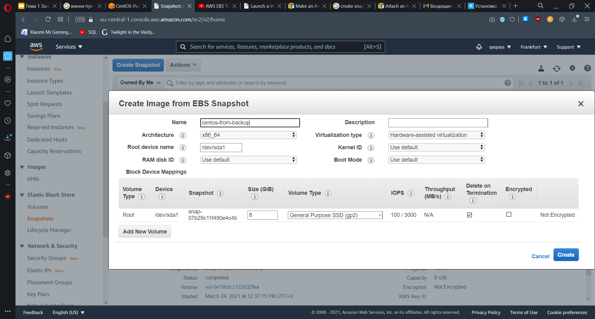
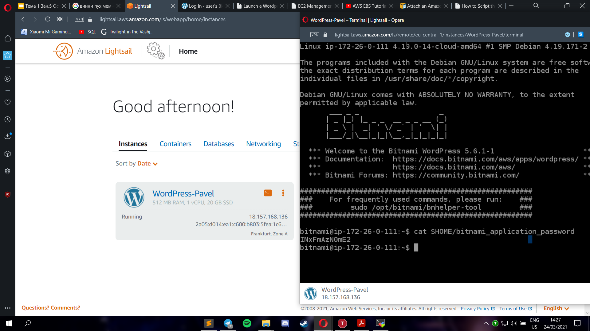
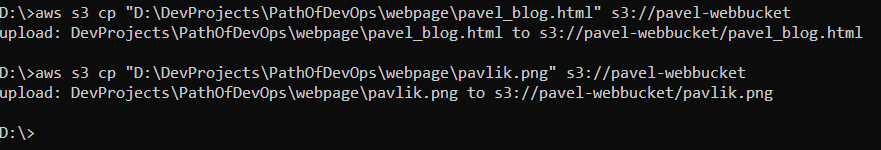

# Task 2.2

I created Linux Virtual Machine using Amazon Lightsail by following tutorial.

After that, I connected to it using MobaXterm. The key file was downloaded during 
the creation of VM. It is used for SSH connection.

Next, I created VM using EC2. I chose cent-os and t2.micro instance. 
For all VMs, availability zone is <code>eu-central-1a</code> on Frankfurt.

And also got access for it using MobaXterm.

To create snapshot, I went to Elastic Block Store -> Snapshots -> Create Snapshot.

I made additional volume for 1GB in the same zone, that I can attach to different VMs.

For the correct attachment, I used commands:

* <code>sudo mkfs -t xfs /dev/xvdf</code> - creates file system on the volume.
* <code>sudo mkdir /data</code> and <code>sudo mount /dev/xvdf /data</code> - locate volume in data and mount volume.

Put text file <code>file_in_Disk_D</code> into /data:

I created new VM using the image from snapshot.

I deattached Disk_D, and attached it to new instance:

Mount is required, so I do <code>sudo mkdir /newdata</code> and <code>sudo mount /dev/xvdf /newdata</code>.

As we see, file <code>file_in_Disk_D</code> moved here with volume.

Next, I created WordPress instance and accessed it through terminal. 
To log into Wordpress Admin Page, I need bitnami password. It is located in:
<code>$HOME/bitnami_application_password</code>

Here I successfully logged to administration dashboard, where I can manage my page.

Next, I created S3 bucket to be able to store and download files from this storage.

Here, I uploaded file to S3, and now have opportunity to retrieve it.

I created IAM user Pavel_Admin with Programmatic access and AdministratorAccess. 
Downloaded .csv file with credentials.

In order to use AWS CLI, I installed AWSCLI and configured it with <code>aws configure</code>. 
I entered corresponding information into cmd.

Different commands were used for uploading, copying and deleting object on S3 through Windows CMD.

I deployed Docker Containers on Amazon Elastic Container Service (ECS).

Online demo application of working cluster.

Next, new S3 bucket was created. It will contain HTML page and all materials used for it.

To upload necessary files, I executed next commands:

Now, I enable static web hosting for my bucket and specified default page for it:

In order for people to be able to access my webpage, I edited access settings and disabled blocking of public access. 
It is also necessary to edit bucket policy. I created JSON with required template, and pasted it to <code>bucket policy</code> field.

Here you can access my webpage using this URL: <a href="http://pavel-webbucket.s3-website.eu-central-1.amazonaws.com">click here</a>

