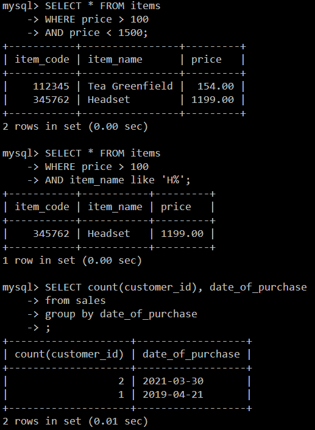
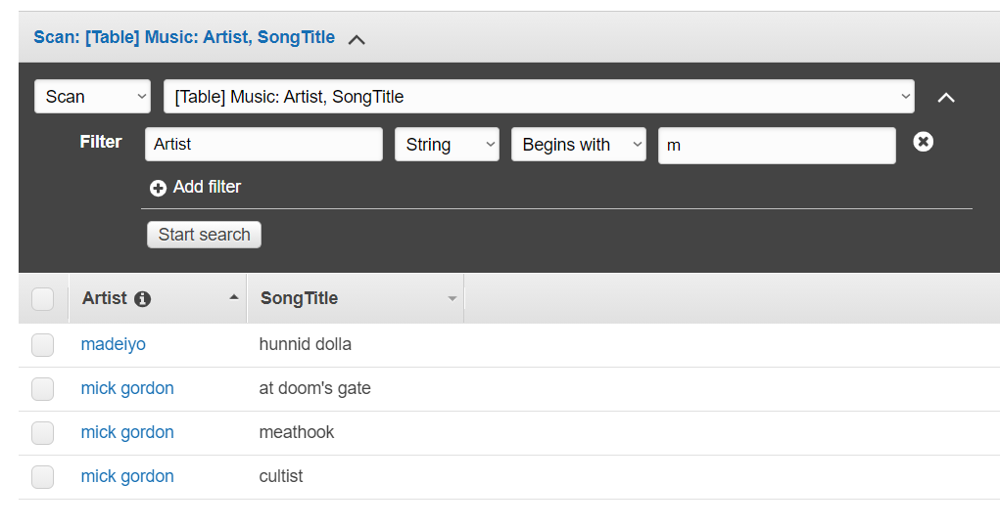

## Task 3.1

###### Part 1

First task was to install MySQL. I have done it with a noninstall ZIP.
All the necessary manipulations have been done to launch mysql server:
creation of `.ini` file and initial run of server with further change of password.
I described database schema and subject area:

To create database through console, I used next commands:

* `create database shop;` - initialization of database.
* `create table sales(fields)` - creation of tables.
* `insert into sales values (1, now(), 2, 3)` - fill the table.

As a result, I have working database with relations between tables:

I tried some SELECT variants with WHERE, GROUP BY to get different data:

I have tried queries of DCL (data definition language) - CREATE, ALTER, DROP, RENAME and
DML (data manipulation language) - SELECT, INSERT, DELETE during the creation of database.

I tried to do queries of DCL (data control language):

To check how privileges work, I created new database, inserted users that I will make and corresponding privilegies.
To create user, I used `CREATE USER` command, to grant permissions `GRAND` and `REVOKE` to remove them. 

Here, I created new connection with other user 'Pavel', and tested what he can and cannot do:

Next, I connected with 'almost_admin', and also checked his privilegies.
Everything works as expected.

I made a selection from db table of mysql database:

###### Part 2

To create backup of my database, I used `mysqldump.exe shop > shop_db.sql -uroot -p`.
I deleted few records from table, and then the table itself:

To restore database, I used command `mysql -uroot -p shop < C:/mysql/shop_db.sql`.
Here is result of restoraion. Everything returned to initial state.

To transfer my database to AWS RDS, first step is to create database instance on AWS RDS service. 

Then, I upload my local database to RDS using command:
`mysql -u admin -p -h shop-db.c6tzqo3q.eu-central-1.rds.amazonaws.com -D shop < shop_db.sql`.
And connect to it using command:
`mysql -h shop-db.c6tzq3u5qo3q.eu-central-1.rds.amazonaws.com -P 3306 -u admin -p`.

Here, I executed a couple of `SELECT` queries:

To save database dump of my database from RDS, I execute next command in my cmd:
`mysqldump.exe -u admin -p -h shop-db.c6tzq3u5qo3q.eu-central-1.rds.amazonaws.com shop > C:\mysql\shop_from_rds.sql` 

###### Part 3

I created DynamoDB table 'Music' and filled it with some data.

In scan section you can add filters to select from table:

Query has wider functionality, adding 'Sort' and 'Attributes'. 
Plus, it searches by keys:

