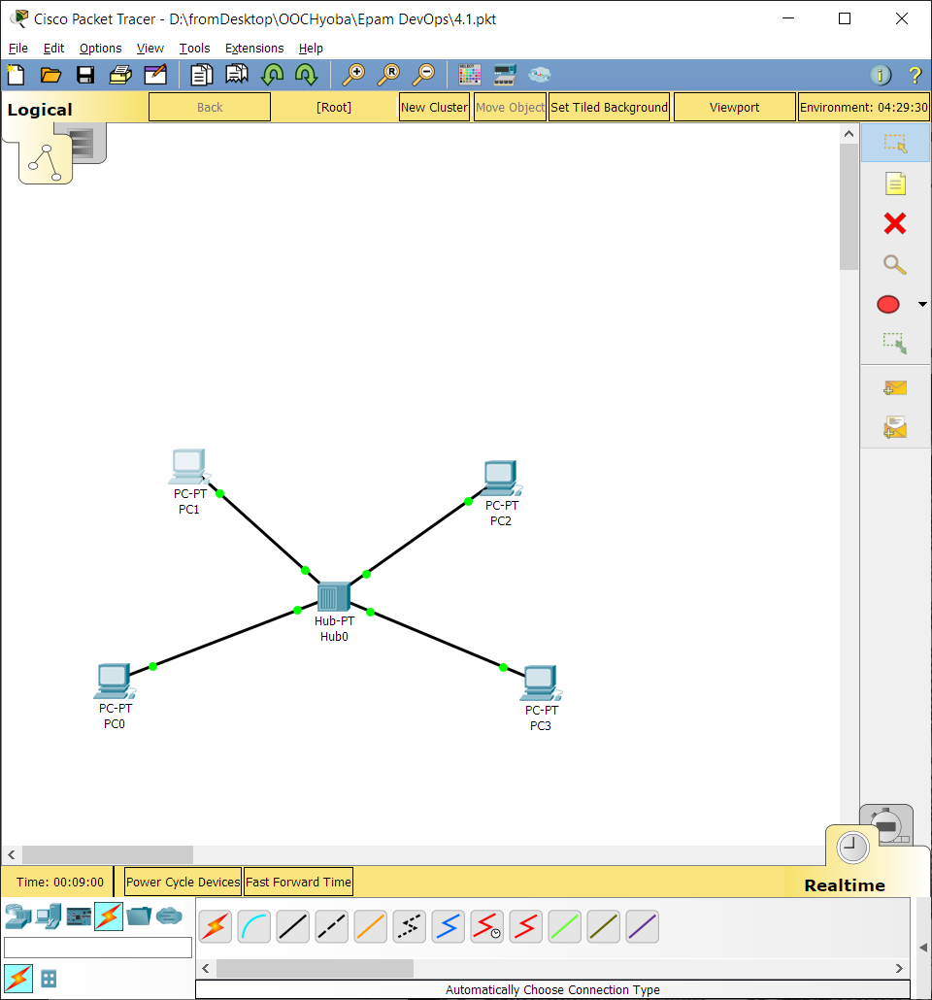
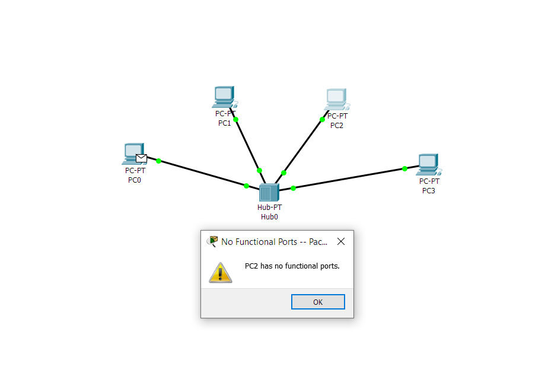
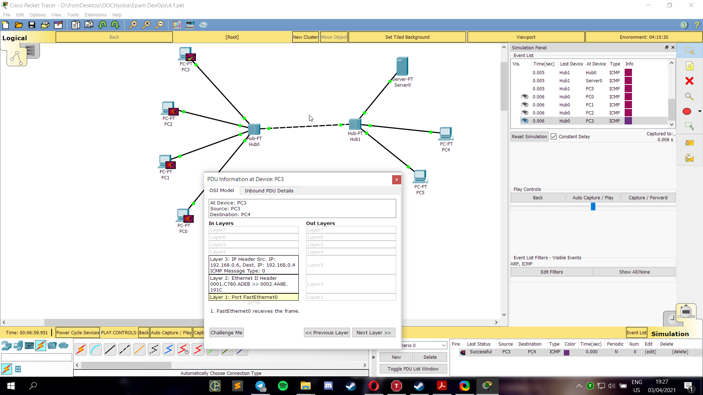

## Task 4.1

I built scheme with 4 PCs connected to hub. Hub is a device, that sends data packets in the form of broadcast.
The reason is that it works on the physical layer of OSI model.  

I configured PCs using instructions, entered IP-addresses for them. 
Here, I tested the work of the topology. 

<!-- 
<video><source src="./screenshots/hub.mp4"></video>
 -->

If I remove IP addresses from PCs and try to ping, I will get error message:

I added another hub and connected devices to it. Here is the test:

As shown in video, on each hub, ICMP packet is sent to every connected device.

Next, I created new network, but connection is organized through switch.
Unlike hub, it works on data-link layer and uses MAC-addresses to forward packets, 
therefore sending packet to 1 PC, not for all connected devices.

ARP packets are sent before ping. They are used to get to know the MAC-address of PC.

<!-- 
<video><source src="./screenshots/switch1.mp4"></video>
 -->

<!-- 
<video><source src="./screenshots/switch2.mp4"></video>
	 -->

I divided 2 networks using router. Therefore, I entered new IP-addresses for PCs as well as for router interfaces.
Router works on network layer and sends packets using IP-addresses. 

<!-- 
<video><source src="./screenshots/router.mp4"></video>
	 -->

We can configure router to use routing protocols, configuring vlans and much more.