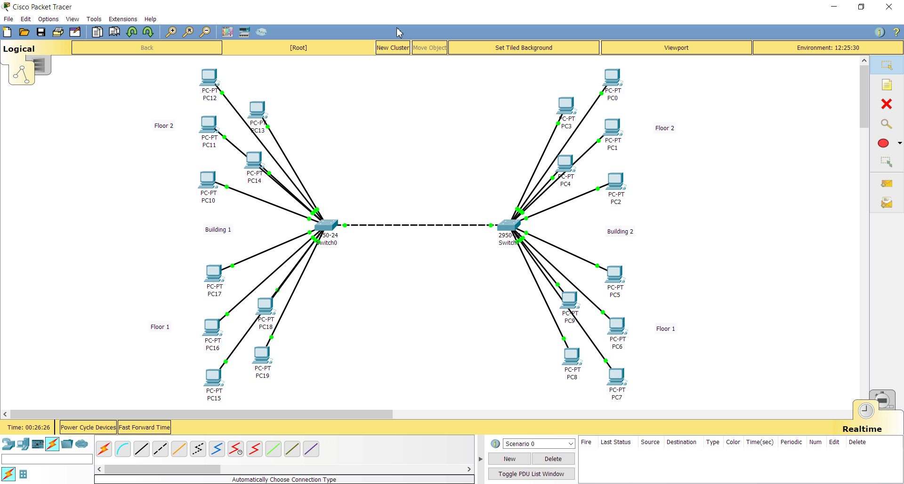

## Task 4.2

#### Task 1

Network contains the model of two buildings with two floors.
Each floor has 5 PCs. I connected each PC from 1 building to switch.
Two buildings are connected with switches:

#### Task 2

I created network with 8 PCs at each floor. 1 and 2, as well as 3 and 4 floor
are conncted to L3 switch. I decided to use L3 switch to configure VLANs.
PCs in different VLANs cannot see each other. Therefore, I created VLAN groups
and configured every interface to belong to needed VLAN. 
Showcase of configurations and test of network:

#### Task 3

I created 5 floors, 6 PCs on every floor, on every floor there is switch,
to which all corresponding PCs connect. Every floor switch connects to L3 switch. Router has one connection with L3 switch. I also decided to configure DHCP server
to make it easier to distribute IP-addresses. 1 floor has been given static adresses,
other 4 floors are changed to get their IPs from DHCP server.
Showcase of configurations and test of network:

