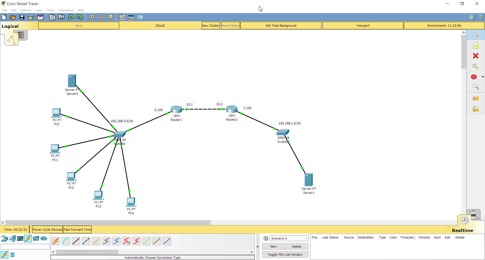
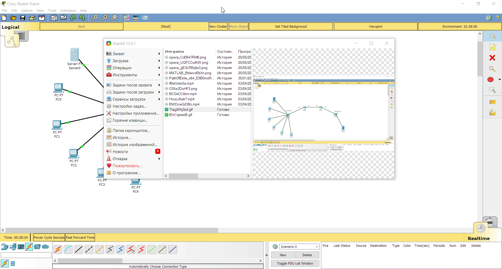

## Task 4.3

I created network with 2 subnets and 2 routers to connect them.
I configured every PC and server, entered IP-addresses and default gateways of corresponding sides of network:

To set password on router, you need to enter configuring state and type `enable secret 'passwd'`.
Now, you should enter password every time you want to make changes in settings. 

Next, I set RIP to transfer packets between the routers. To to that, I opened RIP setting page,
and entered two subnet addresses. Using this table, router will know to what subnet he needs to pass packet in order to rich end user.

Here is detailed video: 

