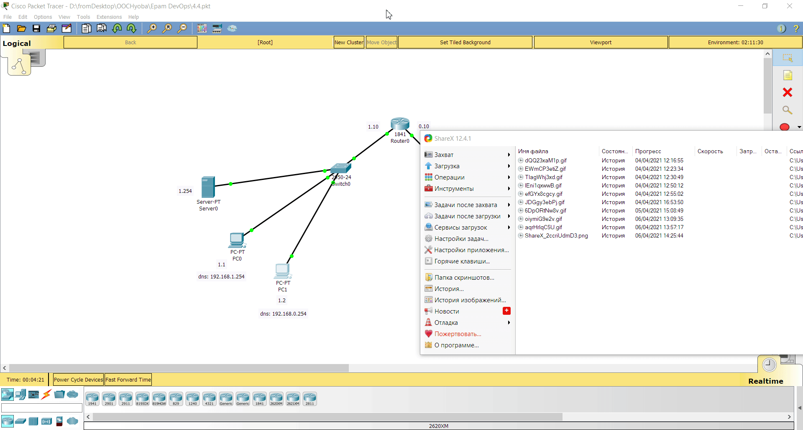
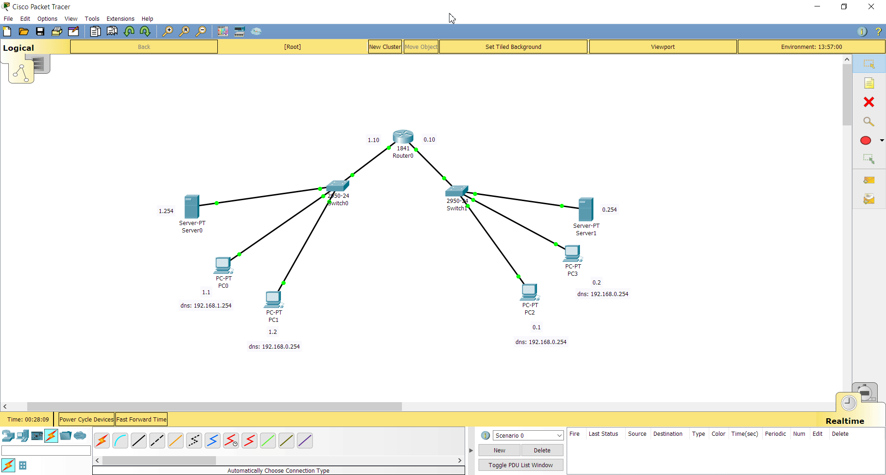

## Task 4.4

#### Task 1

According to task 1, I skipped it because I have done previous task with 2 routers.

#### Task 2

I created network as shown in example.
I configured every PC and server, entered IP-addresses and default gateways of corresponding sides of network.
Also, I filled DNS-address for every PC to define what DNS server it will check.
I enabled DNS service on servers, created an A-Record, which has IP-address linked to name.
After that, I have done tests shown in the video:

Here is configuration + test with HTTP service.

