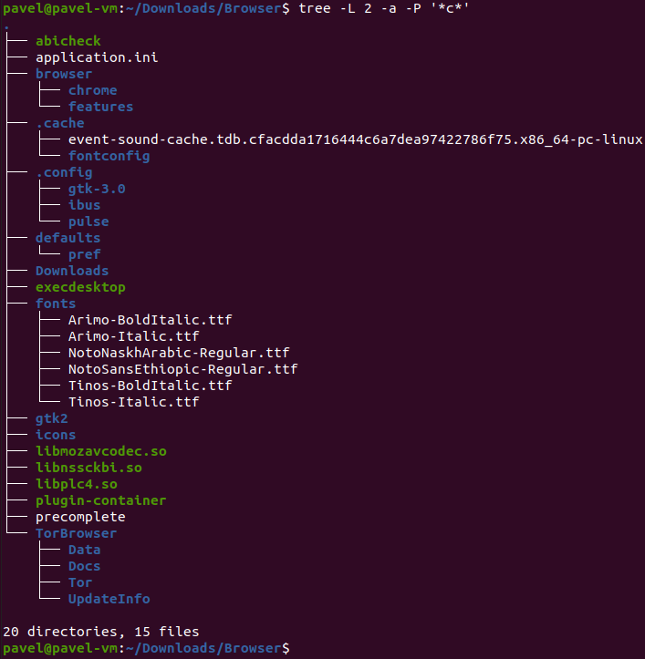

## Task 5.1

#### Part 1

To log in to the system as root, I used command `sudo -i`.
I changed password of user pavel and set value of password chages to 1 per day using flag `-n`. I can also delete password, set password to expire on next login.

`passwd` command changes `/etc/shadow` file, where the hash of the password is stored. 

List of all users in system is stored in file `/etc/passwd`. We can check it by outputing it with `less`. There is also information anount user ID, group ID, home dir, user shell.

To list all commands executed by certain user, command 
`cat /home/USERNAME/.bash_history` can be used. Replace `USERNAME` with needed user. The history of `root` is stored in `/root/.bash_history`. 

To change info about myself, I used command `chfn` with different flags.
To view changes, execute command `finger -l`

`man` and `info` commands are used to open documentation. `--help` flag displays short information about command.
As shown in screenshot, I checked `chfn` and `finger`, and used some flags with them.

`chfn` with `-r` flag allows to change room of user.
`finger` with `-l` flag displays extended information about user.

To output the content of files, `more` or `less` commands can be used.
According to documentation, `less` has more features, `more` is an older version of output.
Here, I used `less` command on `.bash_logout`, `more` on `.bashrc`.

To set plan for `finger` command, I need to create file `.plan`, and put what I need here.
Now, it shows as plan on executing `finger -l`.

`ls` command is used to list contents of directory. 
It can be used with large variety of flags, but most popular are `-a` fot listing all (even hidden files) and `-l` for long listing.

#### Part 2

`tree` command is used to print hierarchy of directories and files.
Flag `-L LEVEL` outpus strucure only at given level, `-P pattern` filters names of files matching certain pattern.
We can list all (hidden) files or only directories with specific keys.

`file` command is used to get information about the type of file.

`cd ~` or `cd` is used to access home directory from anywhere. `..` parent dir, `.` is current dir.
I created `epam` dir in `home`. I performed set of commands listed in screenshot. `cp` is used to copy files.
I renamed one of the files using `mv old_name new_name` command from other terminal.
`rm -R` is used for recursive delerion of directory.

There are 2 types of links - symbolic and hard links. Symbolic link contains path to file, 
hard link contains information about the memory sector which this file is stored in.
File is completely lost if there are no hard links of it.
To create hard link, I used `ln`, for soft link flag `-s` is added.
Hard link has the same volume as file, soft link is very lightweight.
When I deleted original file, I can still access file from hard link, 
but the soft link which pointed to original file is ruined.

`locate` command is used to output paths to files, that contain specified name.
I hadn't find any 'squid' files.

There are few commands to list of mounted partitions, but the best is `lsblk`.
It also displays the type. I have `loop`, `disk`, `part`, `rom` types.

To count the number of lines containing a given sequence of characters in a given file,
I used `grep` command with flag `-c` for counting, next the word and what file to search in.

`find` is great tool, similar to `locate`. First argument is where to look, then flags (`-name`
for search in name), and the pattern itself.

To list all objects in /etc that contain the 'ss' sequence: `find /etc/ -name *ss*`.
Combination with grep: `find /etc/ | grep ss`

To do the screen-by-screen output of contents of `/etc/`, I used `ls -a /etc/ | less`.

There are 4 types of devices in Linux:

* c - character
* b - block
* p - pipe
* s - socket

They are located in `/dev/` folder. The first character is its type.

Next, I have learned about types of files. For Linux, everything is a file.
To find out what type does certain file have, `file` command is used.
Here is the list of types of files:

To list 5 most recently accessed:

* files in /etc/ - `ls -tu /etc/ | head -5`.
* directories in /etc/ -  `ls -dtu /etc/*/ | head -5`.

