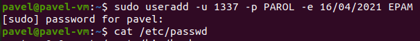
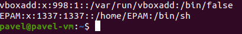

## Task 5.2

List of all users in system is stored in file `/etc/passwd`. 
It contains fields user ID, placeholder for encrypted password from file `/etc/shadow`, group ID, home dir, user shell. 
File `/etc/group` contains records about groups, the fields are group name, placeholder for encrypted password from file `/etc/gshadow`, group ID, list of members

Pseudo-users are not actual users. They are responsible for different processes in system.
The passwords of these pseudo-users in the /etc/shadow file are usually replaced with an asterisk.
Examples:

* deamon - used by system service processes;
* sys - owns system files;
* bin - owns executable files;
* adm - uses registration files.
* ...and so on

UID is unique identifier of user in Linux. It defines what system resouces user can use.
We can find users and their UID in `/etc/passwd`.
Range 1-500 is usually reserved for predefined users. In Ubuntu, actual users have IDs after 1000.

User groups are used to organize access for several users to some resources by GID. 
It is shown after the UID. Every user should be a member in at least 1 group. That's why when new user is created, group with same name is also created.
To find out which groups is certain member in, `groups USERNAME` can be used.

Other method is to look manually in `/etc/group` which groups has which users.

To create user, there are 2 commands available:

* `useradd` - lower level Linux command.
* `adduser` - higher level Perl scenario.

Basic parameters for `useradd` are: -d - home dir, -e - expire date, -p - for password, -u - specify UID.

To rename user, I used command `usermod -l new_name old_name`. Flag `-l` will only change name. 

`/etc/skel` has basic structure of home directory. Contains files that are copied automatically to user's home dir when he is created.

To delete user and his files including mailbox, `userdel` with -r flag is used.

To lock account, I used commands `passwd` and `usermod` with -l/-L and -u/U for unlock.

To remove password, `passwd -d` is used.

The fileds from extended `ls` command are the following: 

1. first symbol is the type of object, after this - permissions for user, group, other.
2. amount of hard links to this object.
3. names of owner.
4. names of group.
5. volume.
6. date of the last modification.
7. object name.

Permissions:
* r - for read
* w - for write
* x - for execution

Every object has 3 sets of permissions - first 3 symbols are for user, next 3 for group and last 3 for others.

The sequence of defining the relationship between the file and the user:

1. If file UID  matches with process UID - current user is owner of file.
2. If file GID matches with any group GID which user is in - he is member of group owning the file.
3. In neither UID and GID of file do not match - user counst as other.

To change the owner of file - `chown USER FILE`.

To change the access - `chmod`.

We can set permmissions using octal representation. Every role has their rights as mentioned before. 
If we take rwx first, we can represent it as decimal converted to binary. For example 7 is 111 in binary, 4 is 100. And if we match it with rwx, then 1 responds for enabling of certain permission on its place.

If I type `chmod 4**` (only for user), 4 is 100 => r - 1, w - 0, x - 0.

umask is used for initial determination of user rights. 
To calculate the permission bits for a new file or directory, we just subtract the umask value from the default value.

To change umask, use command `umask`:

Sticky bit is used on folders in order to avoid deletion of a folder and it’s content by other users though
having write permissions on the folder contents. If Sticky bit is enabled on a folder, the folder contents are
deleted by only owner who created them and the root user.
Here, I add sticky bit by using `chmod +t`.

Command script has to have execution attribute `x`.