## Task 5.3

States of processes are:

* R – running
* S – interruptable_sleep
* D – uninterruptable_sleep
* T – stopped
* Z – zombie

Proc is a unique file system that is used to get information from system core about processes, change it, and send information to processes. It is stored in RAM, information in it is automatically generated when we need to access it.

To get info about processor, I executed command `less /proc/cpuinfo`.

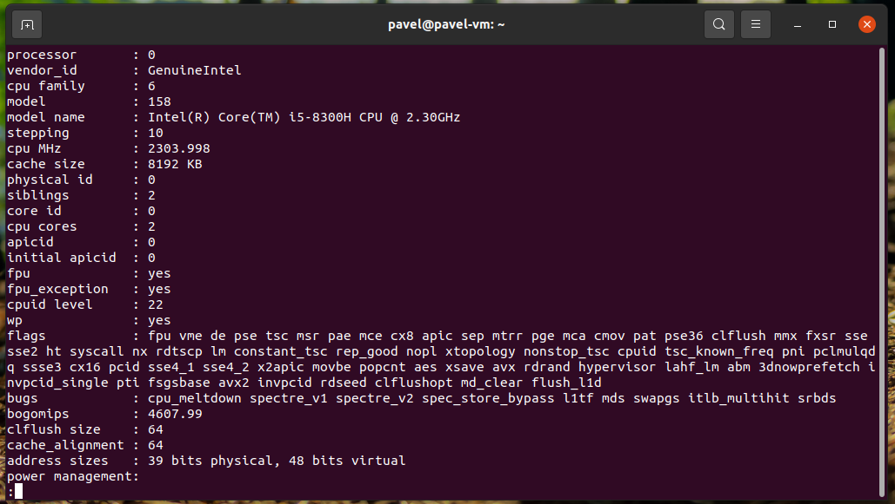

I used the ps command to get information about the process:

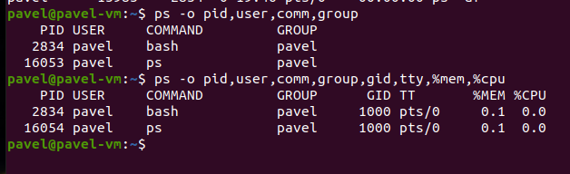

The brackets denote that the process has no command-line arguments, which usually means it was spawned as a kernel process. User processes do not have brackets. 
Command: `ps aux`.

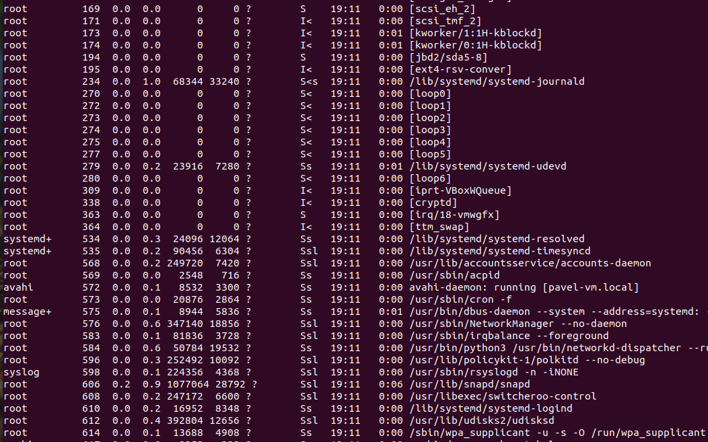

Statuses of processes shown above are:

* < - high-priority 
* N - low-priority 
* L - has pages locked into memory (for real-time and custom IO)
* s - is a session leader
* l - is multi-threaded 
* + - is in the foreground process group.

To display processes of specific user, I used `ps -u <username>`

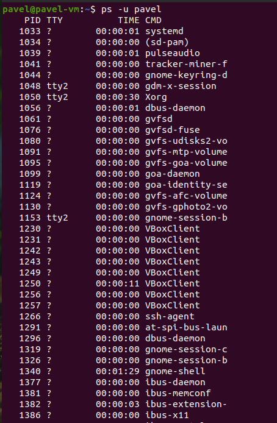

Utilities can be used to analyze existing running tasks:

* ps aux
* pstree
* top

`top` command is used to show the Linux processes. It provides a dynamic real-time view of the running system.

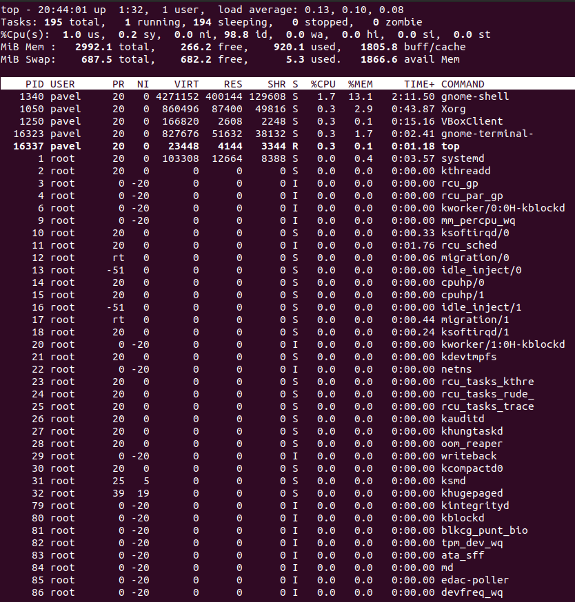

To display the processes of the specific user: `top -u <username>`.

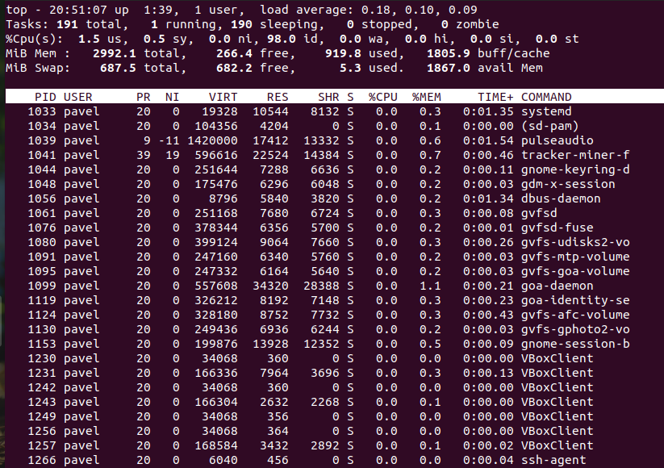

Interactive some of the interactive commands are:

* [1] display all statistics for all cores.
* [h] Display help about the program.
* [k] Kill the process. The program asks you for a process code and a signal that will be sent to it.
* [M] Sort by the amount of used memory.
* [P] Sort by CPU load.
* [u] Sort by username.
* [T] to sort by the running time
* [Space] Refresh the screen immediately 

Here, I sort by CPU load:

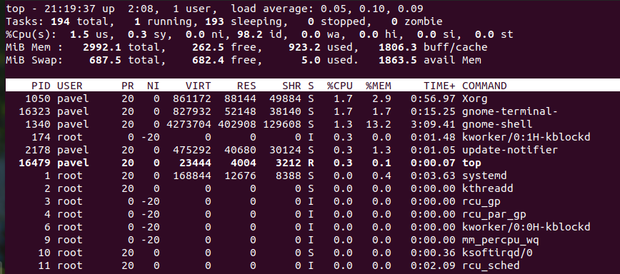

Here, I sort by running time:

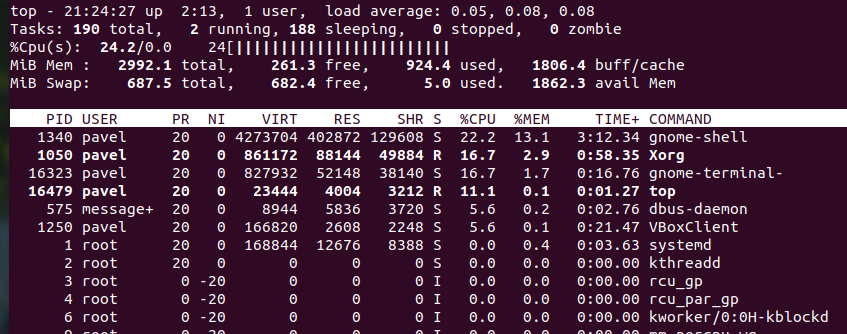

The process priority determines which process gets more CPU time and which processes can wait for execution at a later, less-demanding time.

Commands to change process priority are:

* nice <value> <command> - to launch with specified priority
* renice - to change running processes

It is possible to change the priority of process using `top`. Interactive command [r] is used, then we type PID, and value from -20 (highest priority) to 18 (lowest priority).

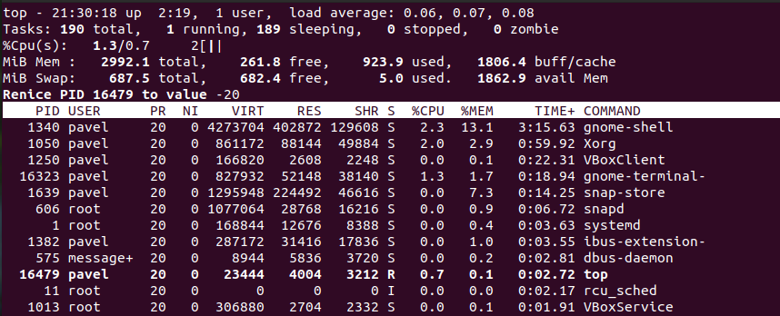

Kill signal command does not only use to stop processes running in the system, but also used to terminate the software from all illegal programs.

Common used signals:
* SIGINT - Signals when the Linux user presses ‘CONTROL-C’
* SIGHUP - Hangs up signals when controlling the terminal or at the end of the controlling processes.
* SIGQUIT	- Signals when the Linux user presses ‘CONTROL-D’
* SIGKILL - When any of the process issues this signal, it will quit immediately.
* SIGTERM	- Signals to terminate the process or the software.
* SIGSTOP	- Signals to stop the process in Linux.

Here, I used `kill -SIGKILL` to send signal for kill of `top` process used before. As a result, he stopped working. 

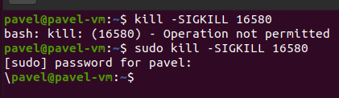

`jobs` is used to display current tasks running in the background. To run command in background, we add `&` to the end of command. It sends it to background.
`bg` and `fg` is used to send stopped task to run in background and foreground respectivly.

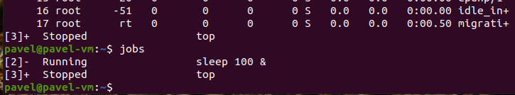

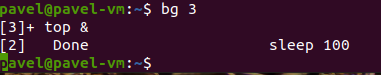

After command `fg 3` top command comes back on screen.
`nohup` is used to add job that will not finish upon exiting system.

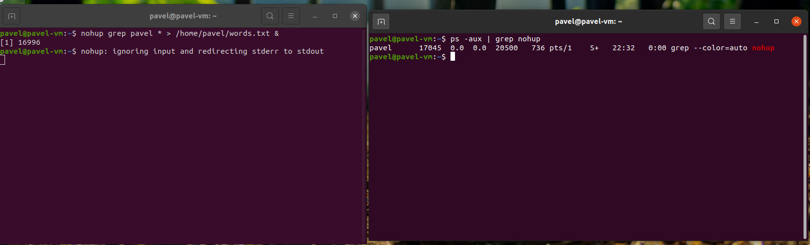

#### Part 2

First od all, I tested connection through ssh using OpenSSH client. I connected to my VM `192.168.0.108`. Also, I created and copied file from server to host using `scp.exe`.

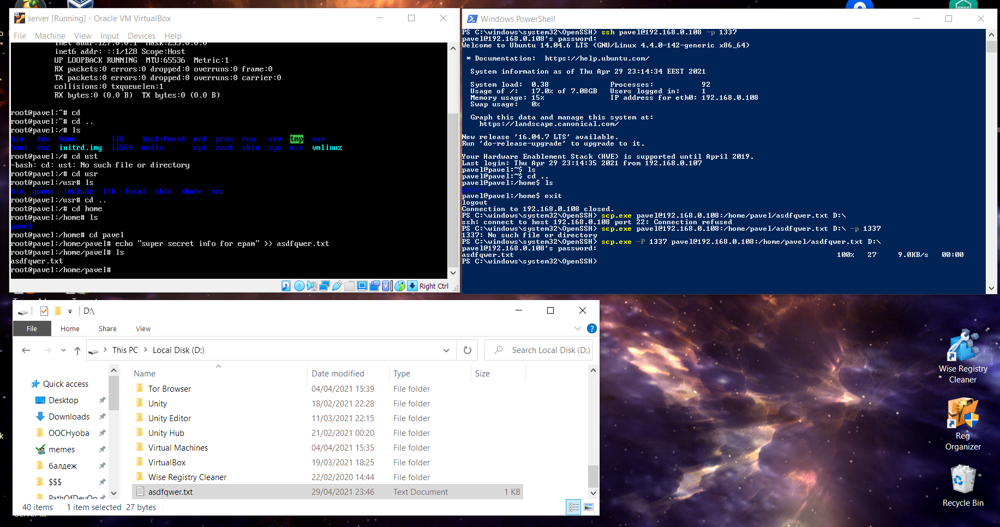

To increase security, we can create secure connection adding asymetric algorithms to exchange information (first RSA).
First, I generate private and public keys and transfer public key to remote machine.

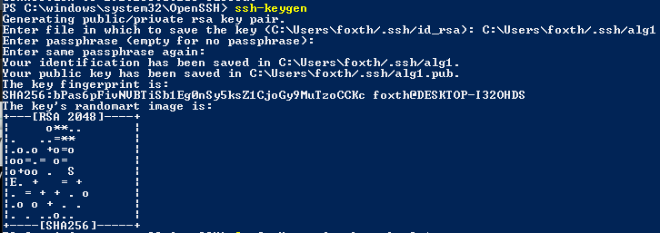

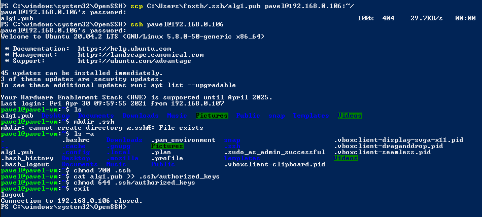

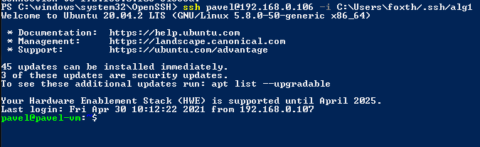

To increase security, on remote machine we should configure `sshd-config` file - disable root promotion, disable password login, enable public key authentication.

Also, for security purposes, I changed ssh port from 22 to 1337.

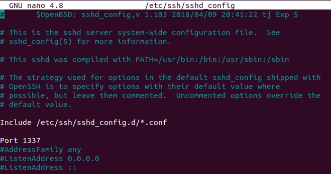

Then, configure firewall to apply settings to it.
`firewall-cmd --permanent --add-port=1337/tcp`
`firewall-cmd --permanent --remove-port=22/tcp`

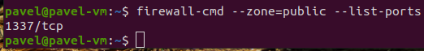

Now, we can not connect through default 22 port. Only through 1337.

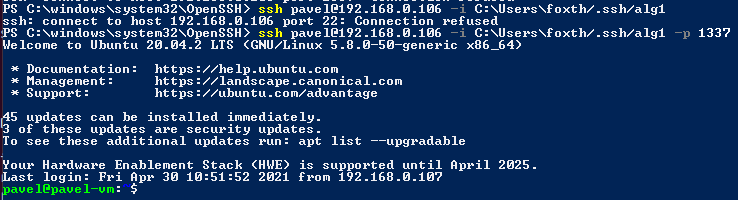

Generating, adding ECDSA key and successfully connectiong:

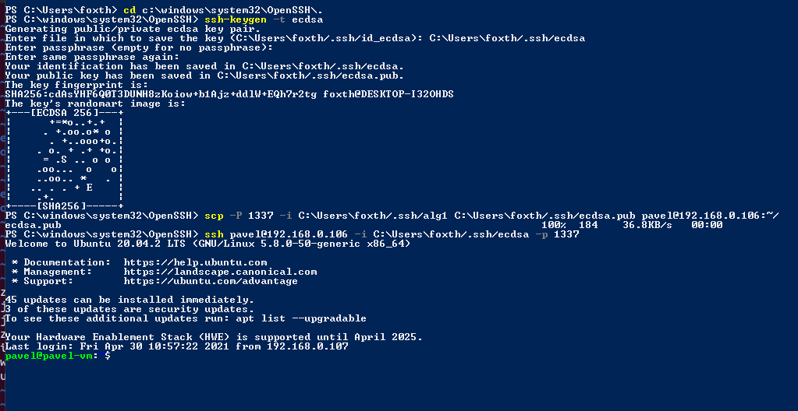

Next, I set port forwarding. I set the host IP for 127.0.0.1:2222 and guest IP to 10.0.2.4:1337. So now I can connect from SSH using address 127.0.0.1 and port 2222 instead of previous settings.

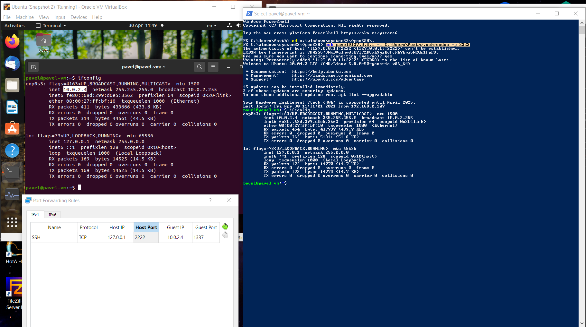

I managed to capture ssh traffic using wireshark. As shown, port is 1337 and protocol is TCP.

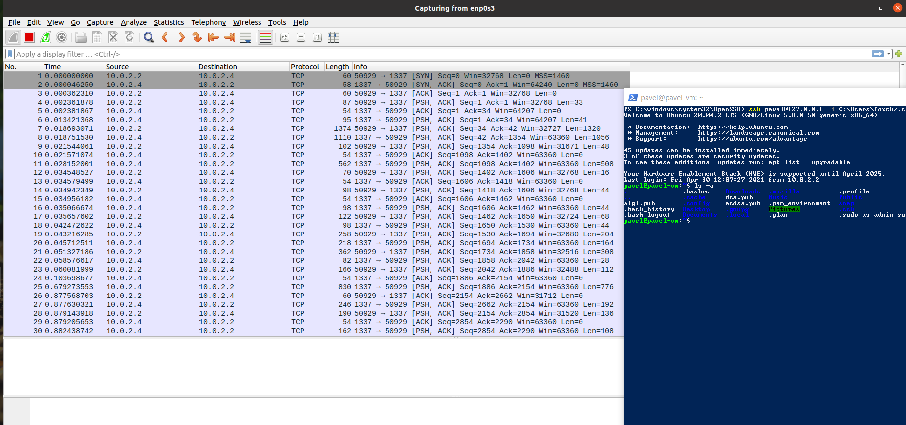
