## Task 6.1

I created 2 VMs on Ubuntu Server 16.04. VM1 (server16.04) has 2 network adapters: NAT and Internal. VM2 (server16.04 Clone) has only Internal adapter. Internal network is myDHCP, but I will assign addresses manually later.

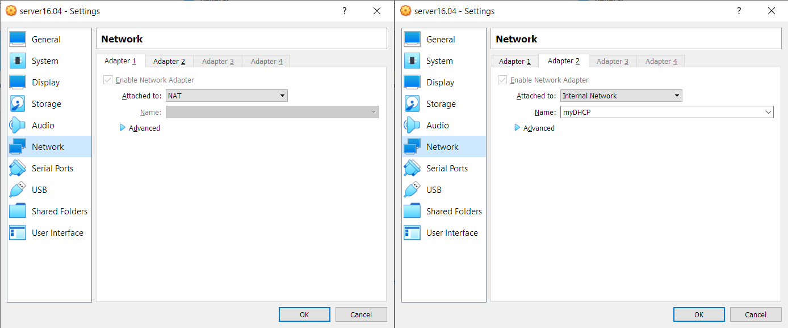

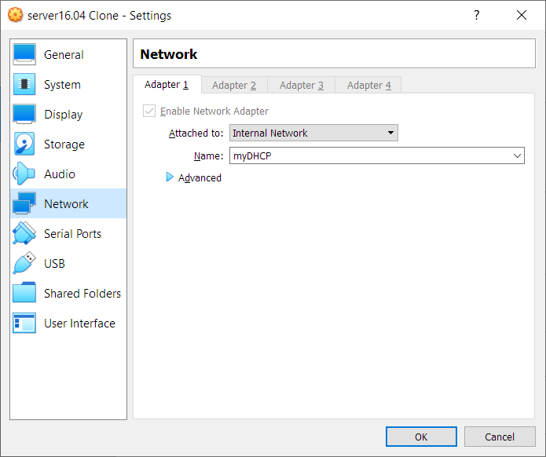

Next, I configured interfaces on VM1 and VM2 in `etc/network/interfaces`.

VM1:

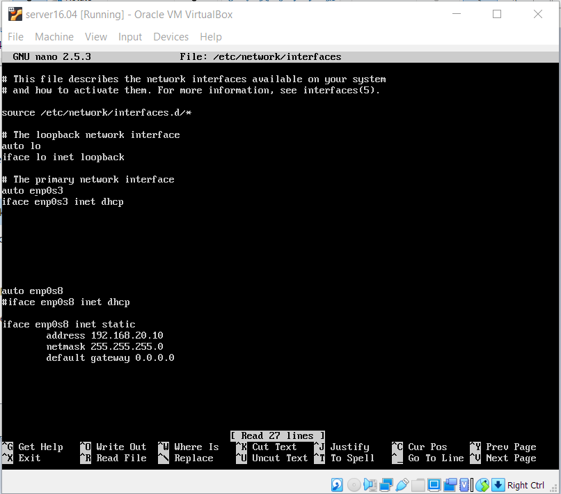

* enp0s3 - NAT adapter
* enp0s8 - Internal

VM2:

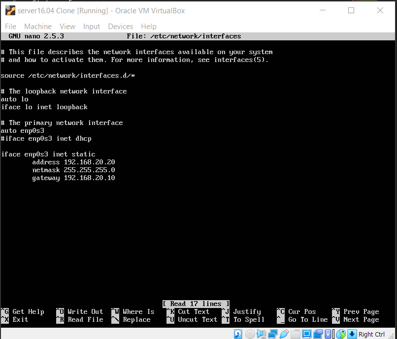

* enp0s3 - Internal

Here, the default gateway is the address of enp0s8 of VM1.

Next, I enabled IP forwarding on VM1 by uncommenting line in `etc/sysctl.conf`:

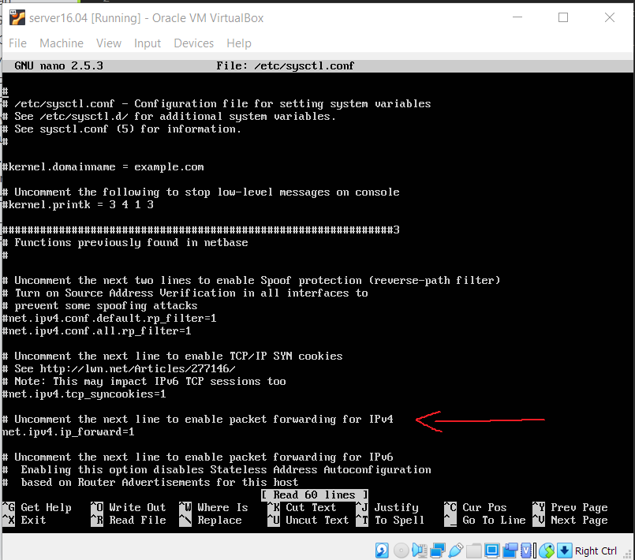

After that, I created new rules in `iptables` to forward packets:

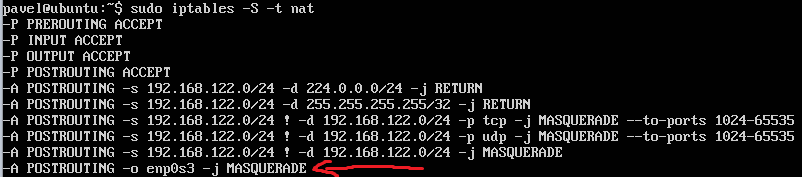

Now, lets test connection:

ping from VM2 to host:

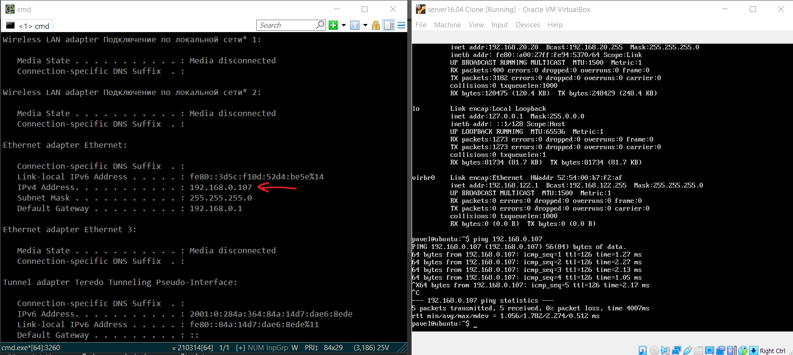

ping from VM2 to internet (8.8.8.8):

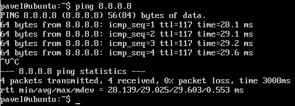

To find out which recource corresponds to which IP, `nslookup` command can be used:

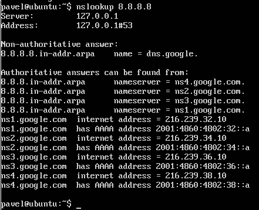

`dig` or `nslookup` can be used to get IP from domain name.

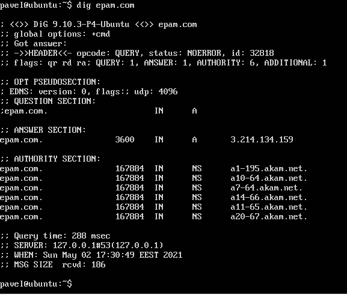

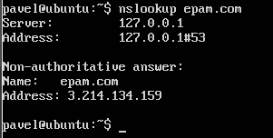

Here is default gateway and routing table (`netstat -rn`) of host:

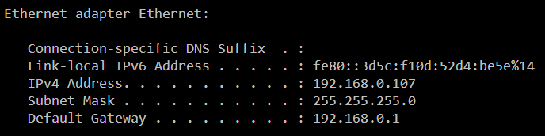

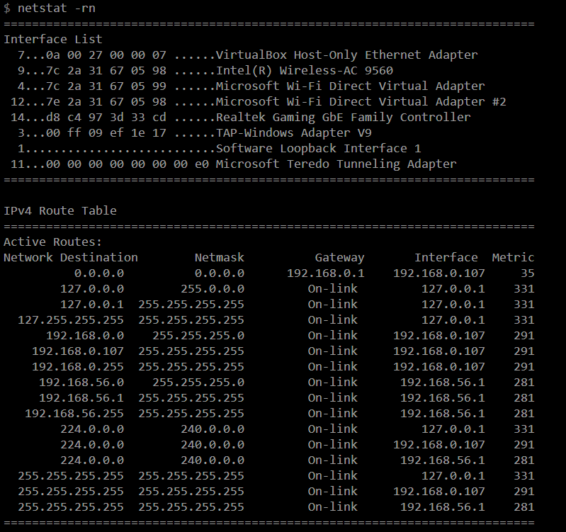

I tested `traceroute` command with -I flag (ICMP) from VM2:

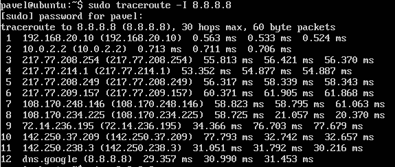
