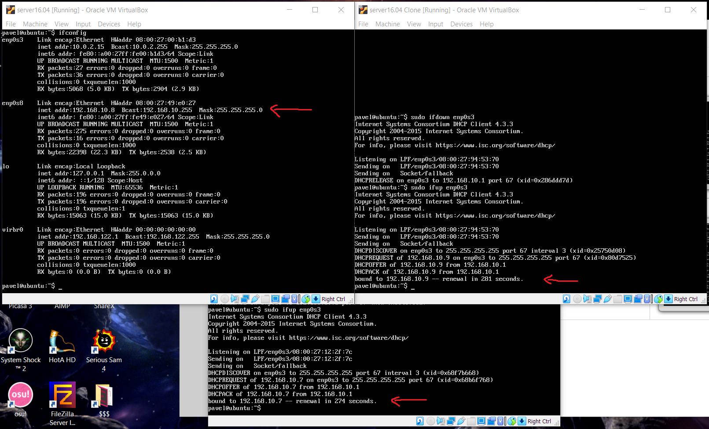

## Task 6.2

I cloned VM2. Now, I have 3 VMs: one with NAT + Internal and two with internal interfaces.
First, I configured DHCP using VBoxManage. I need to create dhcpserver:

I chose every internal adapter to use `myDHCP`. In VMs, in `/etc/network/interfaces/` change static addresses of interfaces to dhcp.
Restart interfaces (ifdown, ifup).

Result of VBoxManage approach:

Next, I configured `dnsmasq` service. I made VM1 Internal interface static IP, then I uncommented some strings in `/etc/dnsmasq.conf`. 

* interface=enp0s8 (internal interface)
* dhcp-range

To demonstrate, in VM settings, I chose `intnet`.

Next, I configure DNS on VM1, I uncomment `prepend domain-name-servers` line in `/etc/dhcp/dhclient.conf` and check `/etc/resolv.conf` nameserver.

Also, for further testing I enable packet forwarding on VM1:

I check the work of DNS-server on VM2 and VM3 by using `dig`:

