## Task 7.1

1) Output of IP, that made the most requests and number of requests:

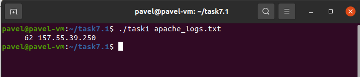

Script:

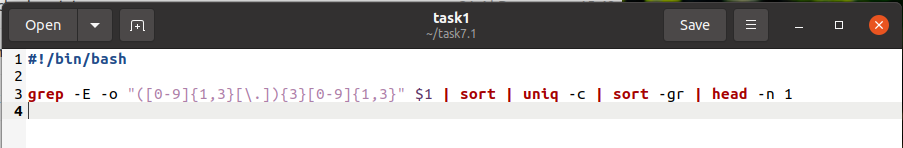

2) Output of the most requested page and number of requests:

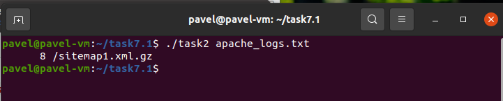

Script:

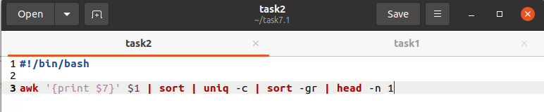

3) Amount of requests from every IP:

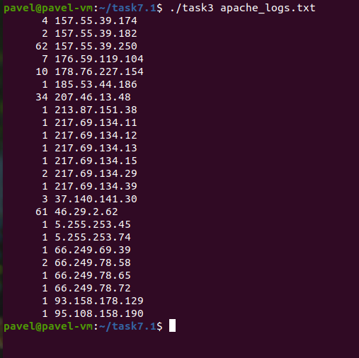

Script:

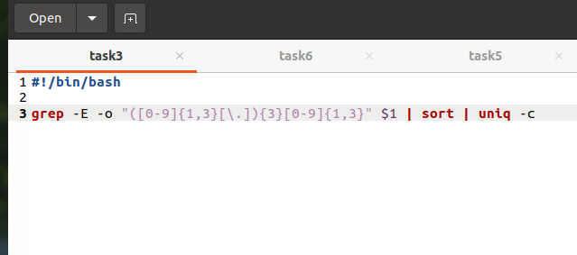

4) Non-existent pages were clients referred to (404 error):

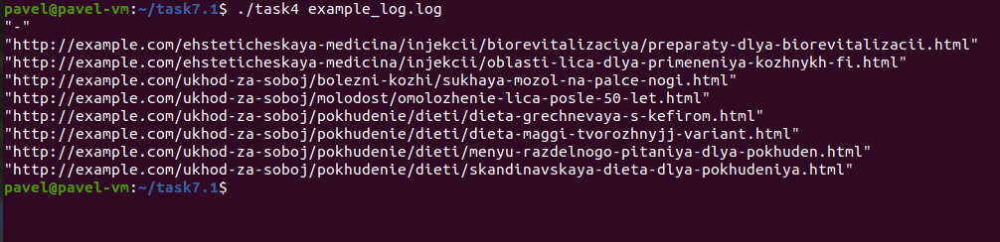

Script:

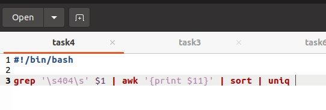

5) Time, when site get the most requests:

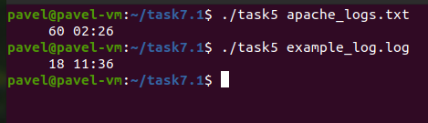

Script:

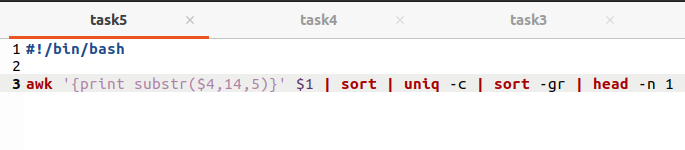

6) IP and User agents accessed the site:

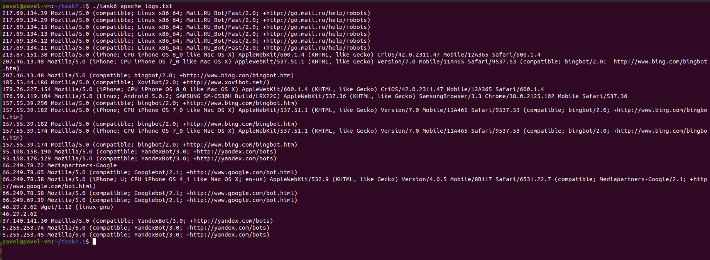

Script:

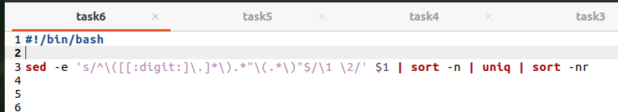
