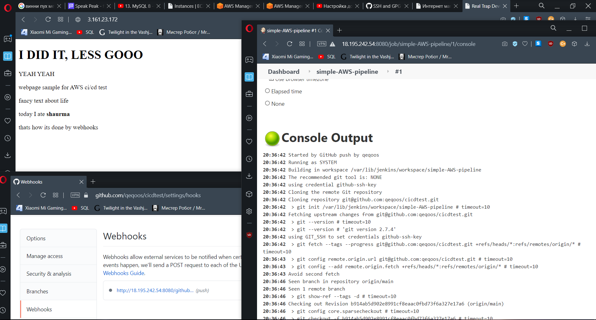

## Task 8.1

Deploy on configured SSH server using Publish over SSH plugin - "Send build artifacts over SSH":

To create simple CI/CD pipeline, first I generate keys and add public key into my account on github.
After that, I check authentication with ssh.

Then, I generate one more key for jenkins machine, entering PUBLIC key from it.
Next, in jenkins UI I configure job, add key here and paste PRIVATE key to it, and type github ssh project link.

I also add publish over ssh to post it on my apache machine.

Next, I created CI/CD pipeline using AWS.
I created EC2 instance, installed jenkins on it. I added build trigger by github webhook.
In my project on github, I added webhook itself to trigger on push.
I got one more EC2 instance, installed apache on it, enabled publish-over-ssh for this pipeline on jenkins.

I made pipeline with slaves. Got 2 VMs, one with tags `ubuntu`, second with `apache`.
I configured them, added open key to authorized_keys, and deployed site from github onto machine with `apache` tag.

Finally, I made pipeline project with jenkins script:

